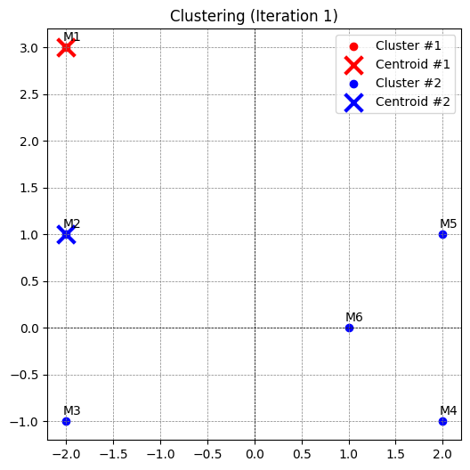
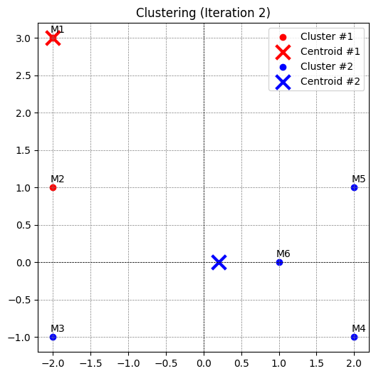
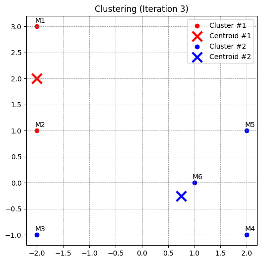
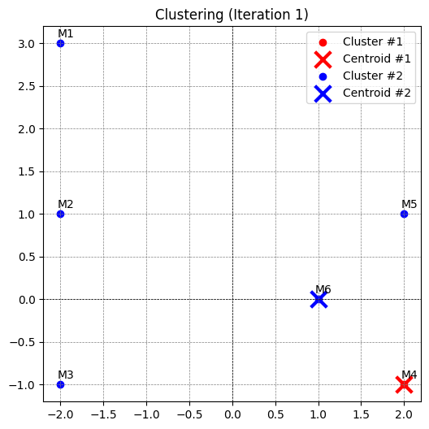
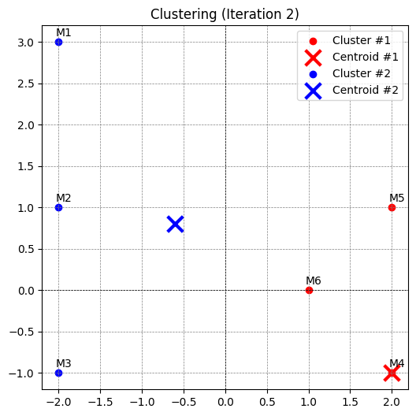
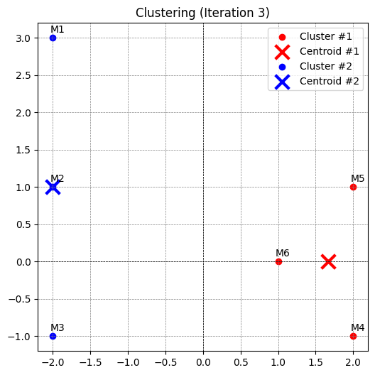
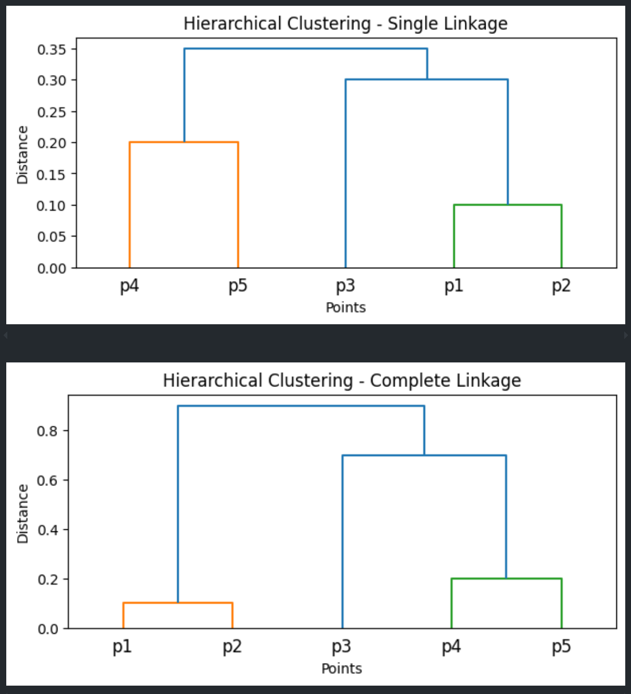
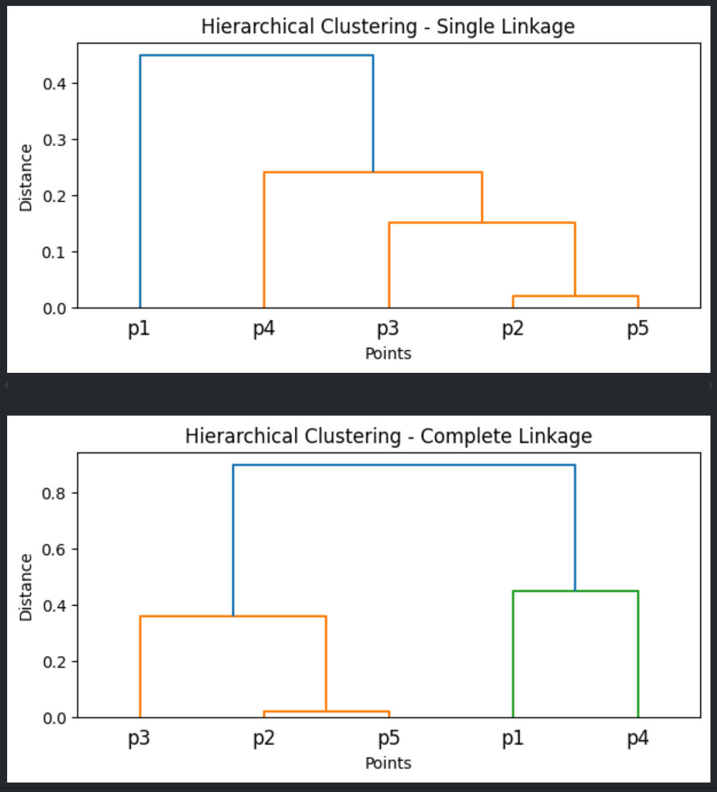
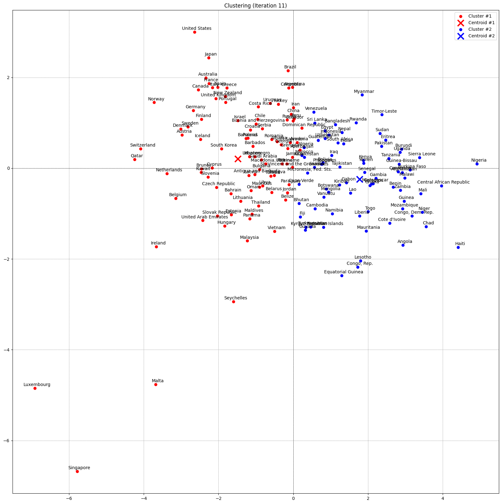
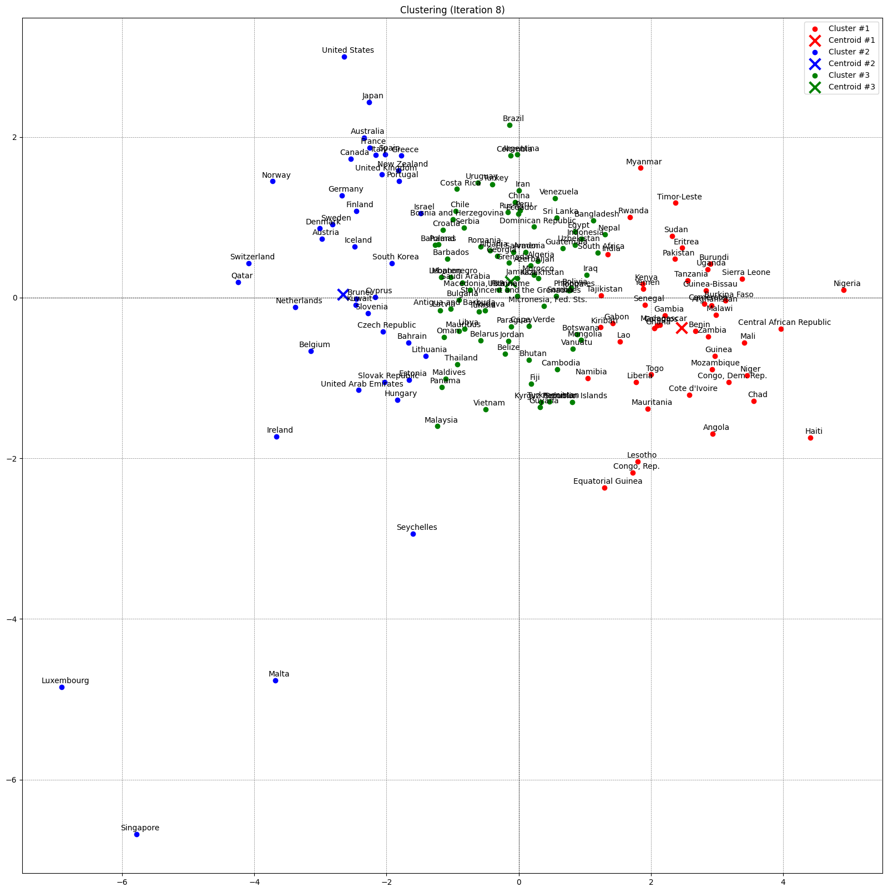

## 1. Clustering K-means
#### 1. Implémenter algorithme K-means clustering

#### 2. Tester la fonction sur le jeu de données 1D : [[2], [4], [6], [12], [24], [30]]
Question: Pour chaque configuration de centroides initiaux, ajoutez les résultats dans le compte rendu,    ainsi qu’une courte discussion, en précisant notamment si vous avez obtenu un clustering meilleur que l’autre.

Résultat pour le configuration 1: Centroids initiaux [2, 6]
```
Test (a) initial centroids: [[2], [6]]
Final Centroids: [[np.float64(6.0)], [np.float64(27.0)]]
SSE: 2.5
Number Iterations: 4
All Iterations: {'iteration-1': [[2], [6]], 'iteration-2': [[np.float64(3.0)], [np.float64(18.0)]], 'iteration-3': [[np.float64(4.0)], [np.float64(22.0)]], 'iteration-4': [[np.float64(6.0)], [np.float64(27.0)]]}
```

Résultat pour le configuration 2: Centroids initiaux [12, 24]
```
Test (b): [[12], [24]]
Final Centroids: [[np.float64(6.0)], [np.float64(27.0)]]
SSE: 2.5
Number Iterations: 2
All Iterations: {'iteration-1': [[12], [24]], 'iteration-2': [[np.float64(6.0)], [np.float64(27.0)]]}
```

Les deux options de centroids intiaux retourneront la même résultat (SSE: 2.5 et centroids finaux [[6], [27]]) mais avec la centroid initial [[12, 24]] algorithme ne doit que passer 2 itérations pour 
avoir la clustering final alors que la centroid initial [[2], [6]] a besoin plus de nombre d'itération
pour avoid la clustering final
#### 3. Visualiser l'état de cluster pour chaque itération
Test Case 1: Initial Centroids = [[-2, 3], [-2, 1]]




Test Case 2: Initial Centroids = [[2, -1], [1, 0]]




Pour reproduire les images à partir le code, vous ne devez juste qu'exécuter le bloc de code qui est
marqué avec la commentaire "Exercice 3" ou exécuter toutes les blocs.

#### 4. Utiliser lib skcitlearn
data1 = [[1], [2], [18], [20], [31]]  
print(KMeans(n_clusters=3, n_init=1, init=array([[1], [2], [18]])).fit(data1).labels_)  
affiche [0 1 2 2 2]  

Cela signifie que la cluster 1 contient le point 1, la cluster 2 contient le point 2 et la cluster 3
contient les points 18, 20, 31. Donc c'est la même résultat que notre implémentation dans l'exercie 1.

## 2. Clustering Hiérachique
La résulat pour le jeu de données data = [0.1, 0.9, 0.35, 0.8, 0.3, 0.4, 0.5, 0.6, 0.7, 0.2]  

La résultat pour le jeu de données similarity_matrix:
D'abord, nous convertissons la matrice en forme compacte
```
distance_matrix = 1 - similarity_matrix

condensed_distance_matrix = distance_matrix[np.triu_indices(len(distance_matrix), k=1)]
```




